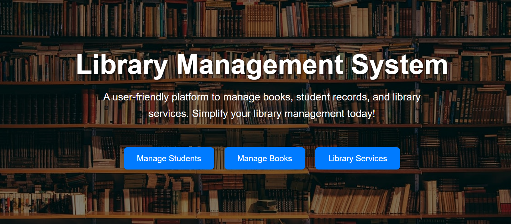
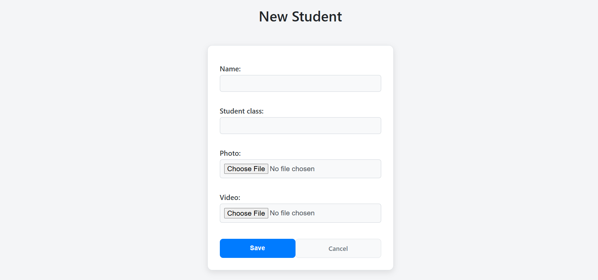
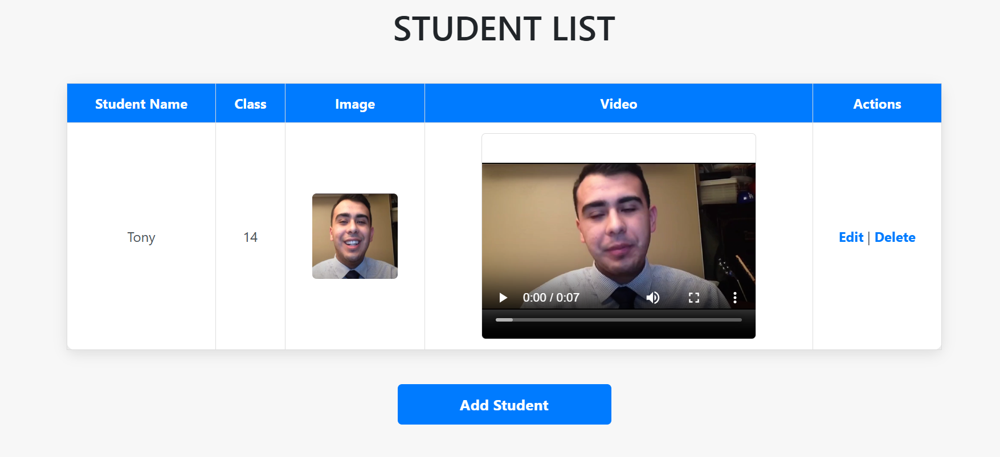
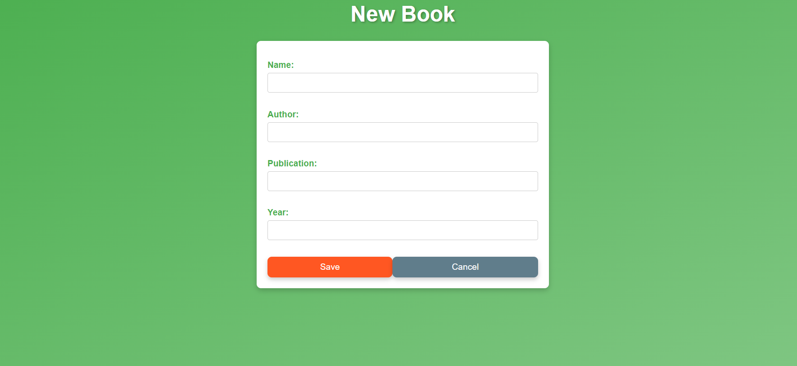
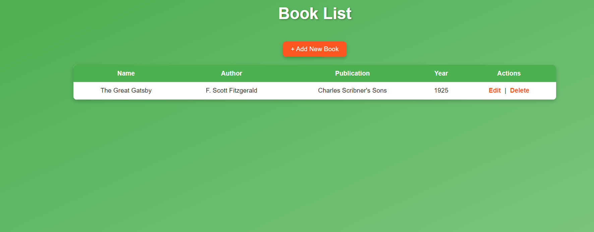
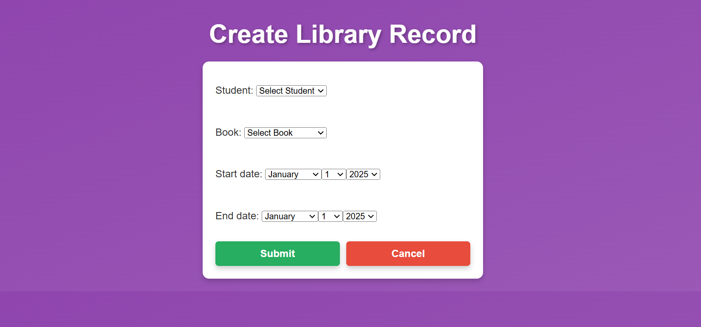
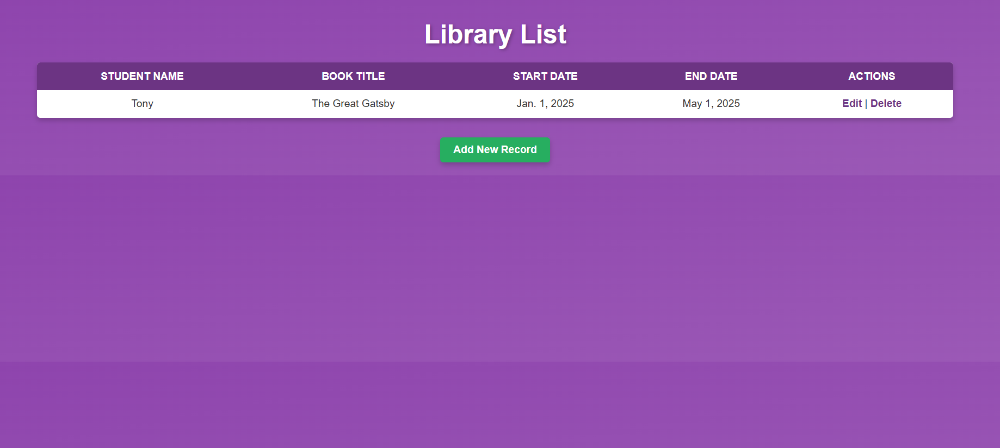

# 📚 Library Management System

This project is a Django-based web application designed to manage libraries, books, and student interactions. It provides functionalities for adding, viewing, and managing details related to libraries, books, and students.

## 🔧 Features
- Add, update, and delete details of students, books, and libraries.
- View lists of all students, books, and libraries.
- Simple and intuitive user interface.
- Deployed on Render for live access.

## 🌐 Live Demo
Access the live version of the project here: [Library Management System](https://library-management-system-slgz.onrender.com/)

## 🧳 Technology Stack
- **Backend**: Django Framework
- **Frontend**: HTML, CSS, and Bootstrap
- **Database**: SQLite3 (default Django database)
- **Deployment**: Render

## 🔮 Setup Instructions

### Prerequisites
- Python 3.11
- pip (Python package installer)
- Git

### Steps to Run Locally
1. Clone the repository:
   ```bash
   git clone https://github.com/Sujith-1608/library_management_system.git
   ```
2. Navigate to the project directory:
   ```bash
   cd library_management_system
   ```
3. Install dependencies:
   ```bash
   pip install -r requirements.txt
   ```
4. Apply migrations:
   ```bash
   python manage.py migrate
   ```
5. Start the development server:
   ```bash
   python manage.py runserver
   ```
6. Access the application at `http://127.0.0.1:8000/` in your web browser.

## 🔓 Admin Access
1. Create a superuser:
   ```bash
   python manage.py createsuperuser
   ```
2. Log in to the admin interface at `/admin`.

## 📈 Screenshots

### 🏠 Home Page


### 👨‍🎓 Student Module
- **Student Form**
  
- **Student List**
  

### 📖 Book Module
- **Book Form**
  
- **Book List**
  

### 🏛️ Library Module
- **Library Form**
  
- **Library List**
  

## 🎯 Future Enhancements
- Add user authentication for role-based access.
- Integrate advanced search and filtering options.
- Enhance the UI/UX for a better user experience.

## 💎 Credits
Developed by [Sujith Reddy Sama](https://github.com/Sujith-1608).

## 🛒 License
This project is licensed under the MIT License. See the [LICENSE](LICENSE) file for details.

